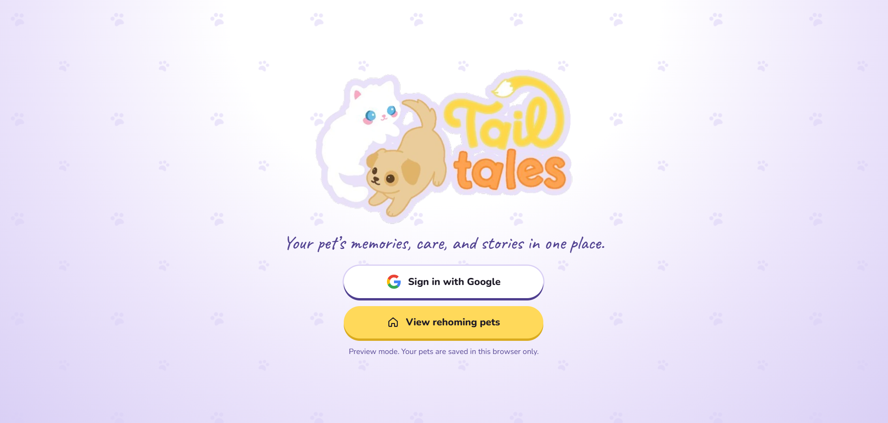
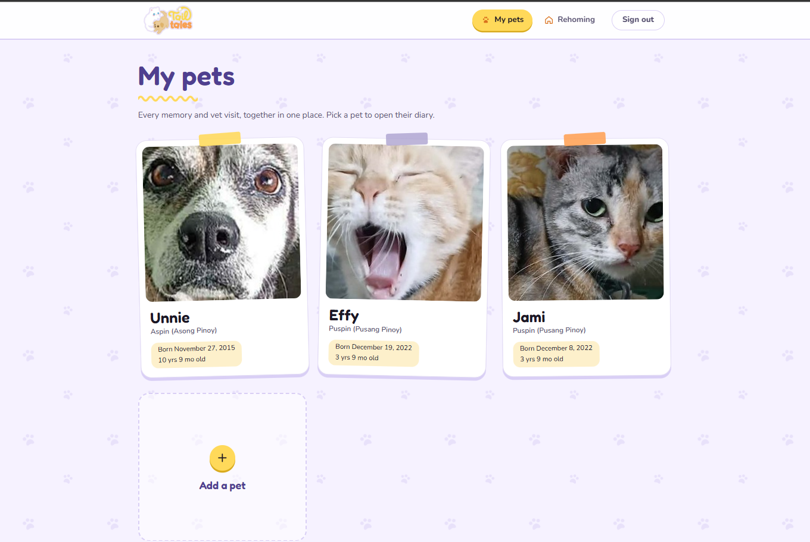
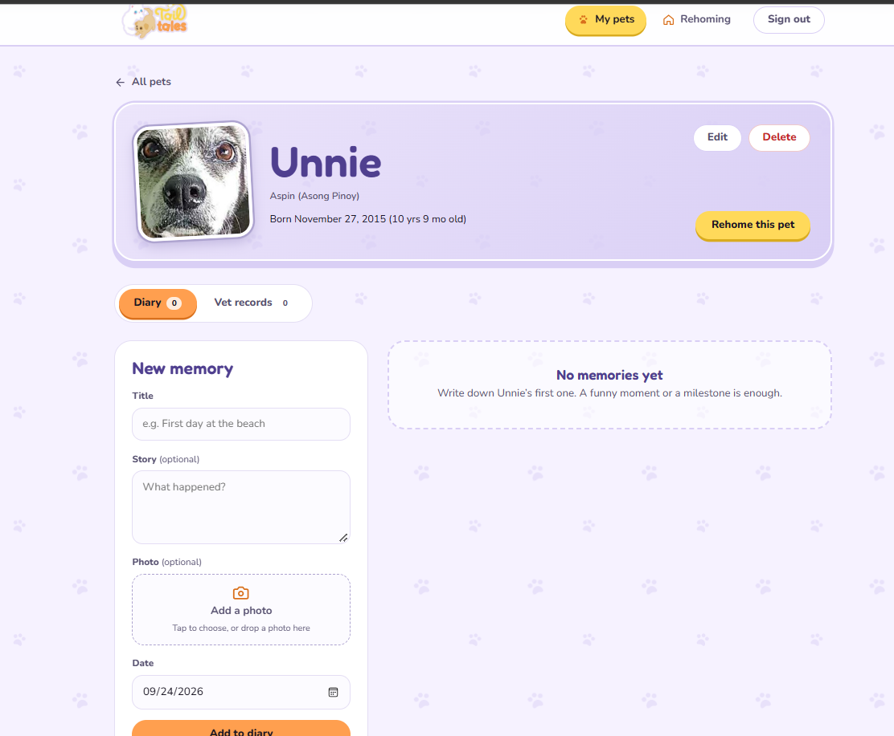
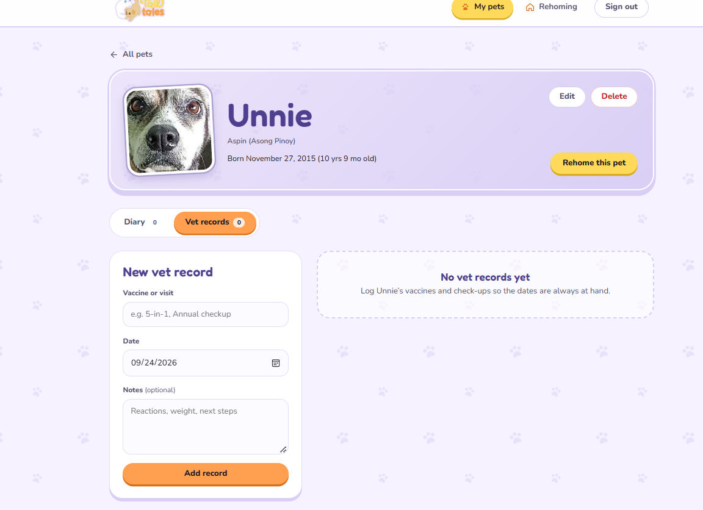
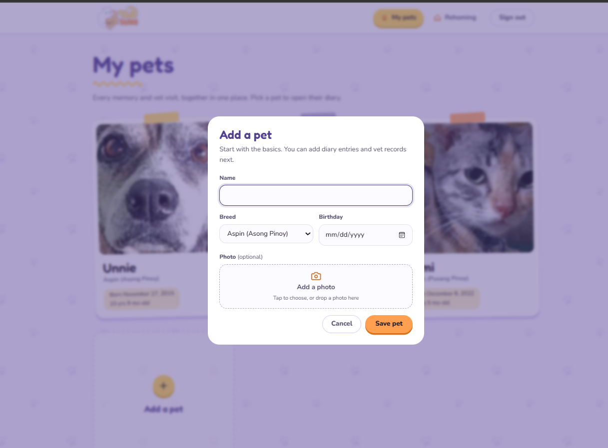
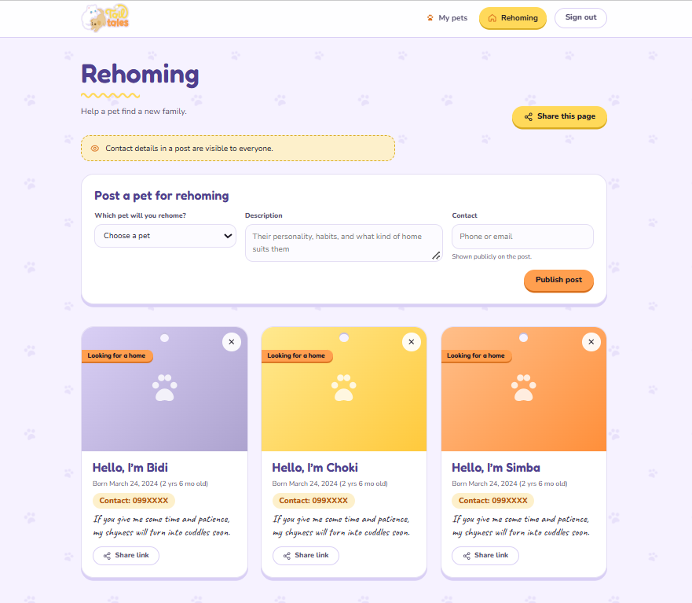

# Mockup

The current design is a responsive, interactive HTML prototype with exported
screen images. The HTML file is the primary reference; the images are previews
for review and submission.

## Prototype

[Open the tailTALES prototype](../assets/wireframes/new/mockup.html)

The prototype is self-contained. Its preview mode uses browser `localStorage`
and simulated sign-in; it is not the production app and must not be used for
real or private pet data.

## Screens

### Sign-in

Google sign-in and a direct route to public rehoming posts.

### My Pets (signed-in home)

Pet cards, age and birthday details, and an Add a pet action. Pet forms support
photo selection and edit flows.

### Pet Diary (`#/pets/:id` in the prototype)

The pet header leads into Diary and Vet Records tabs. Diary entries and vet
records have separate add forms and list states.

### Rehoming (`#/rehoming` in the prototype)

The page explains that contact details are public, provides a post form for
signed-in owners, and lets visitors browse and share posts.

## Interactions and responsive behavior

The prototype includes pet and record forms, Diary/Vet Records navigation,
empty states, confirmation dialogs, public post sharing, and guest/signed-in
views. The preview data stays in the current browser.

At 820px and below, the diary form and list stack and wide form rows become
single-column. At 640px and below, the main navigation moves to a bottom tab
bar and the top bar becomes compact. Reduced-motion preferences are respected.

The finished implementation should be compared with this reference; note any
intentional differences in the weekly report and final demo notes.